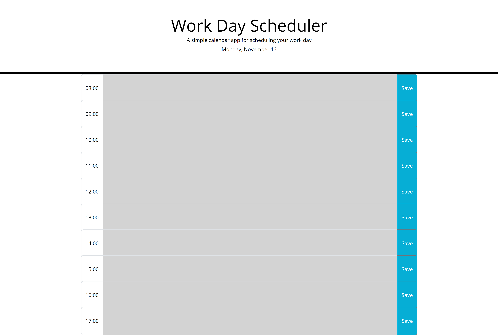
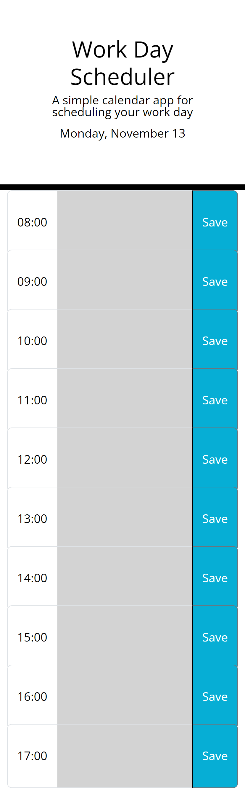

# work-day-scheduler

[Click to view deployed site](https://cariberrii.github.io/work-day-scheduler/)

## Description

AS AN employee with a busy schedule  
I WANT to add important events to a daily planner  
SO THAT I can manage my time effectively

This planner utilizes bootstrap input groups to layout a daily schedule interface which displays the timeblocks between the hours of 8am-5pm (finishing at 6pm). Each timeblock is color-coded based on the past (grey), present (red), and future (green) when the timeblock is viewed. It allows the user to enter an event when they click a timeblock and write a maximum of two rows of text. This way, items on the to-do list will be viewed without having to scroll within the block for hidden and potentially overlooked tasks. The tasks entered by the user are stored in local storage when the save button is clicked for the corresponding timeblock and remain on the schedule when refreshed.

## Table of Contents

- [Desktop View](#desktop-view)
- [Tablet View](#tablet-view)
- [Mobile View](#mobile-view)
- [Credits](#credits)
- [License](#license)

## Desktop View

## Tablet View

## Mobile View

## Credits

Bootstrap: Input groups:  
https://getbootstrap.com/docs/5.3/forms/input-group/

GitHub Gist: Limit the number of lines in a textarea:  
https://gist.github.com/nicohaemhouts/cd1c95c4e342ff65589b

Day.js: Display Format:  
https://day.js.org/docs/en/display/format

## License

MIT License

Copyright (c) 2023 Cari Fillingham

Permission is hereby granted, free of charge, to any person obtaining a copy
of this software and associated documentation files (the "Software"), to deal
in the Software without restriction, including without limitation the rights
to use, copy, modify, merge, publish, distribute, sublicense, and/or sell
copies of the Software, and to permit persons to whom the Software is
furnished to do so, subject to the following conditions:

The above copyright notice and this permission notice shall be included in all
copies or substantial portions of the Software.

THE SOFTWARE IS PROVIDED "AS IS", WITHOUT WARRANTY OF ANY KIND, EXPRESS OR
IMPLIED, INCLUDING BUT NOT LIMITED TO THE WARRANTIES OF MERCHANTABILITY,
FITNESS FOR A PARTICULAR PURPOSE AND NONINFRINGEMENT. IN NO EVENT SHALL THE
AUTHORS OR COPYRIGHT HOLDERS BE LIABLE FOR ANY CLAIM, DAMAGES OR OTHER
LIABILITY, WHETHER IN AN ACTION OF CONTRACT, TORT OR OTHERWISE, ARISING FROM,
OUT OF OR IN CONNECTION WITH THE SOFTWARE OR THE USE OR OTHER DEALINGS IN THE
SOFTWARE.

